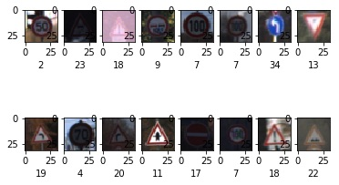
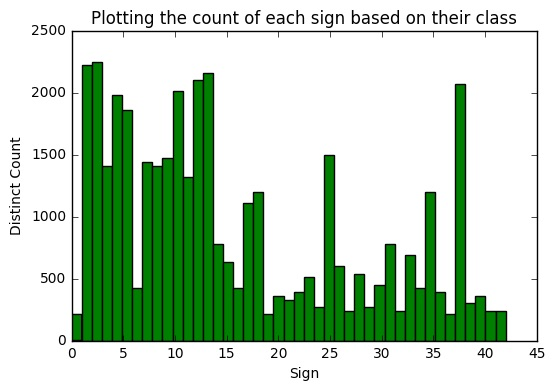
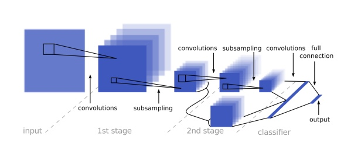

### Dataset Exploration

####  Summary of the data set.

<h2> Step 0 : Load the DATA</h2>

I created a dictionary <b> sign_dictionary </b> to recognize the signs faster rather than lookingup their class number, it reflects the signnames.csv

Exploratory Visualization of the dataset

The training and test sets are provided as a form of pickle data.

Pickle  “serialises” the object first before writing it to file. Pickling is a way to convert a python object (list, <b>dict</b>, etc. ) into a character stream. This character stream contains all the information necessary to reconstruct the object.

<pre>

training_file = "traffic-signs-data/train.p"
testing_file = "traffic-signs-data/test.p"

with open(training_file, mode='rb') as f:
    train = pickle.load(f)
with open(testing_file, mode='rb') as f:
    test = pickle.load(f)
    
X_train, y_train = train['features'], train['labels']
X_test, y_test = test['features'], test['labels']

</pre># SignClassification

I doubled checked that I have as many labels as data:
<pre>
print (" Size of X_train is %d labels is %d" %(len(X_train), len(y_train)))
print (" X_train Labels are", train['labels'])
print (" Size of X_test is %d labels is %d" %(len(X_test), len(y_test)))
print (" X_test Labels are", test['labels'])
</pre>

<h2> Step 1: Dataset Summary & Exploration </h2>
#### The pickled data is a dictionary with 4 key/value pairs:

- `'features'` is a 4D array containing raw pixel data of the traffic sign images, (num examples, width, height, channels).
- `'labels'` is a 1D array containing the label/class id of the traffic sign. The file `signnames.csv` contains id -> name mappings for each id.
- `'sizes'` is a list containing tuples, (width, height) representing the the original width and height the image.
- `'coords'` is a list containing tuples, (x1, y1, x2, y2) representing coordinates of a bounding box around the sign in the image.

The data are in the directory <b>traffic-signs-data</b> with:
<li> <b>train.p</b> a serialised file of 120.7MB </li>
<li> <b>test.p</b> a serialised file of 38.9 MB  </li>
(file not uploaded becasue going over file size limit on GitHub)

Description of the data:

<li>Number of training examples = 39209 </li>
<li>Number of testing examples = 12630 </li>
<li>Image data shape = (32, 32, 3) </li>
<li>Number of classes = 43 </li> using a unique collection of items is to use a <b>set</b>

<b> We have a total of 39209+12630 = 51839 examples.
Training data is 75% and test set is 25% which is a good mix for a classification.</b>

The training set is explored by showing a plot of 2 lines and 8 images per line:
<pre>
# Visualizing randomly 16 images from the training set
print (" TRAINING SET EXCERPT")
for i in range(16):
    plt.subplot(4,4,i+1)
    plt.imshow(X_train[random.randint(0,n_train)])
plt.show()
</pre>

VISUALIZING TRAINING SET 
<li>index 6 is End of speed limit (80km/h)</li>
<li>index 13 is Yield</li>
<li>index 13 is Yield</li>
<li>index 9 is No passing</li>
<li>index 13 is Yield</li>
<li>index 5 is Speed limit (80km/h)</li>
<li>index 33 is Turn right ahead</li>
<li>index 25 is Road work</li>
<li>index 35 is Ahead only</li>
<li>index 37 is Go straight or left</li>
<li>index 7 is Speed limit (100km/h)</li>
<li>index 34 is Turn left ahead</li>
<li>index 3 is Speed limit (60km/h)</li>
<li>index 28 is Children crossing</li>
<li>index 2 is Speed limit (50km/h)</li>
<li>index 10 is No passing for vehicles over 3.5 metric tons</li>  

The distribution of the classes is obtained with:
<pre>
plt.hist(y_train, n_classes, color='green')
</pre>

### Design and Test a Model Architecture

#### Preprocessing

<b> Normalize the data </b>

Normalization helps the algorithm performing more quickly.
NORMALIZATION OF DATA: colors on a 0-255 scale => 0-1 scale
Follows the equation normalized = (x - min( x )) / (max ( x )- min( x ))

<b> shufling the data </b>

<pre>
      
#shuffling the Data
X_train_norm, y_train = shuffle(X_train_norm, y_train)
print("DATA SHUFFLED --")

# SPLITTING THE DATA using 20% to create the validation set
X_train_norm, X_val, y_train, y_val = train_test_split(X_train_norm, y_train, test_size=0.2, random_state=42)
print ("DATA SPLIT --")

</pre>
#### LeNet ARCHITECTURE 

The chosen architecture follows LeNET paper:

INPUT -> CONV -> ACT -> POOL -> CONV -> ACT -> POOL -> FLATTEN -> FC -> ACT -> FC
LeNET architecture accepts only 32x32xC images, here is in the good format, no padding needed

<pre>
Network parameters
n_input = 32 * 32 * 3
nb_filters = 32
kernel_size = (3, 3)
input_shape = (32, 32, 3)
n_fc1 = 512
n_fc2 = 128
in_channels = 3
pool_size = 2 # i.e. (2,2)

dropout_conv = 0.9
dropout_fc = 0.9

weights_stddev = 0.1
weights_mean = 0.0
biases_mean = 0.0

padding = 'VALID'
if padding == 'SAME':
conv_output_length = 6
elif padding == 'VALID':
conv_output_length = 5
else:
raiseException("Unknown padding.")
</pre>

<h2> PREPROCESSING the data </h2>
<b>NORMALIZATION OF DATA so that the data has mean zero and equal variance in intensity:</b>
 colors on a 0-255 scale => 0-1 scale

<h2> ADDING IMAGES IN CLASSES WITH VERY FEW INSTANCES </h2>

From the histogram it can be noted that not all classes have the same number of images, some classes are underepresented which can introduce a bias towrads a better recognition for some sign more than for others.

For instance the class 0 has only 180 images; I listed the indexes of this class.

It is possible to increase the number iof images by applying affine transformations liek rotations.
I applied random rotations on 14 images and concatenated them to the trainign data (before splitting this set to obtain the validation data).

<b> Should also be done: <b> a proportional number of augmented images should be added in the test set to keep a 25% or 33% ratio.
 Follows the equation normalized = (x - min( x )) / (max ( x )- min( x ))

<h2> TRAINING DATA , VALIDATION DATA TESTING DATA <h2>

# SPLITTING THE DATA using 20% to create the validation set
X_train_norm, X_val, y_train, y_val = train_test_split(X_train_norm, y_train, test_size=0.2, random_state=42)

I chose a subset of 20% of the trainign data to represent the validation data for which we must reach at least 93% accuracy.

<h2> LeNet Archi hyper parameters </h2>

The following parameters gave the best compromise accuracy and speed ( results obtained in 7 minutes on a PC Intel i5-4590 @ 3.30GHza and 16GB of RAM)

Choosing EPOCH =12 
BATCH_SIZE 256 
rate = 0.001 

<pre>
Training...

EPOCH 1 : Accuracy on validation data = 0.219
time from start: 34.302
EPOCH 2 : Accuracy on validation data = 0.451
time from start: 68.134
EPOCH 3 : Accuracy on validation data = 0.545
time from start: 101.895
EPOCH 4 : Accuracy on validation data = 0.749
time from start: 138.296
EPOCH 5 : Accuracy on validation data = 0.793
time from start: 173.591
EPOCH 6 : Accuracy on validation data = 0.804
time from start: 208.587
EPOCH 7 : Accuracy on validation data = 0.871
time from start: 244.013
EPOCH 8 : Accuracy on validation data = 0.867
time from start: 282.842
EPOCH 9 : Accuracy on validation data = 0.864
time from start: 319.547
EPOCH 10 : Accuracy on validation data = 0.870
time from start: 354.816
EPOCH 11 : Accuracy on validation data = 0.922
time from start: 391.457
EPOCH 12 : Accuracy on validation data = 0.933
time from start: 425.398
</pre>

<b> Validation Set showed a 93.3% accuracy </b> 
<b> Test Set showed a 85.3% accuracy </b> 

<h2> Validation on images extracted from Internet </h2>

I uploaded in the directory assets/ 5 images, each image has the name of the class number 12.jpg, 18.jpg, 22.jpg, 38.jpg, 40.jpg  

I reloaded the model and submitted the vector of images to get the following results:

<pre>
INFO:tensorflow:Restoring parameters from ./lenet
Model restaured successfully
Expected label 12 - Prediction: 12
Expected label 18 - Prediction: 26
Expected label 22 - Prediction: 17
Expected label 38 - Prediction: 38
Expected label 40 - Prediction: 40
Test Set Accuracy = 0.600
</pre>

The Top 5 softmax probabilities obtained are:

<pre>
Image test is Priority road:

Priority road: 99.96440410614014
Speed limit (70km/h): 0.019403475744184107
No entry: 0.013063951337244362
Traffic signals: 0.0031365267204819247
Speed limit (30km/h): 8.850940119708994e-09

Image test is General caution:

Traffic signals: 100.0
General caution: 3.5200559134196396e-08
Children crossing: 2.0678940504392784e-08
Beware of ice/snow: 1.8212848763854428e-10
Bumpy road: 1.430857710961464e-10

Image test is Bumpy road:

No entry: 98.10700416564941
Speed limit (30km/h): 1.519086305052042
End of speed limit (80km/h): 0.33944568131119013
Beware of ice/snow: 0.02565415925346315
Children crossing: 0.007559994992334396

Image test is Keep right:

Keep right: 100.0
Yield: 1.277249746939324e-09
Go straight or right: 6.878460474812886e-12
Turn left ahead: 2.704504838057175e-13
Roundabout mandatory: 1.8990632202163103e-14

Image test is Roundabout mandatory:

Roundabout mandatory: 100.0
Turn right ahead: 1.3727263683399604e-10
Keep right: 4.5225162590561974e-11
Keep left: 1.162860298945499e-13
Go straight or left: 4.7074041332114953e-14
</pre>

It is interested to see that apart from the General Caution the model mistook the image for a traffic signal. However General Caution was still in the mix for selection. 
The image I found were pretty clean so no surprise that Keep right got a good results.

Interesting to see that Priority Road got recognized, the imaged is a little warped and has some blue background color, same for roundabout-mandatory. The CNN worked perfectly in those examples. 
