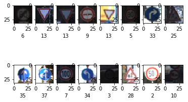

### Dataset Exploration

####  Summary of the data set.

<h2> Step 0 : Load the DATA</h2>

I created a dictionary <b> sign_dictionary </b> to recognize the signs faster rather than lookingup their class number, it reflects the signnames.csv

Exploratory Visualization of the dataset

The training and test sets are provided as a form of pickle data.

Pickle  “serialises” the object first before writing it to file. Pickling is a way to convert a python object (list, <b>dict</b>, etc. ) into a character stream. This character stream contains all the information necessary to reconstruct the object.

<pre>

training_file = "traffic-signs-data/train.p"
testing_file = "traffic-signs-data/test.p"

with open(training_file, mode='rb') as f:
    train = pickle.load(f)
with open(testing_file, mode='rb') as f:
    test = pickle.load(f)
    
X_train, y_train = train['features'], train['labels']
X_test, y_test = test['features'], test['labels']

</pre># SignClassification

I doubled checked that I have as many labels as data:
<pre>
print (" Size of X_train is %d labels is %d" %(len(X_train), len(y_train)))
print (" X_train Labels are", train['labels'])
print (" Size of X_test is %d labels is %d" %(len(X_test), len(y_test)))
print (" X_test Labels are", test['labels'])
</pre>

<h2> Step 1: Dataset Summary & Exploration </h2>
#### The pickled data is a dictionary with 4 key/value pairs:

- `'features'` is a 4D array containing raw pixel data of the traffic sign images, (num examples, width, height, channels).
- `'labels'` is a 1D array containing the label/class id of the traffic sign. The file `signnames.csv` contains id -> name mappings for each id.
- `'sizes'` is a list containing tuples, (width, height) representing the the original width and height the image.
- `'coords'` is a list containing tuples, (x1, y1, x2, y2) representing coordinates of a bounding box around the sign in the image.

The data are in the directory <b>traffic-signs-data</b> with:
<li> <b>train.p</b> a serialised file of 120.7MB </li>
<li> <b>test.p</b> a serialised file of 38.9 MB  </li>
(file not uploaded becasue going over file size limit on GitHub)

Description of the data:

<li>Number of training examples = 39209 </li>
<li>Number of testing examples = 12630 </li>
<li>Image data shape = (32, 32, 3) </li>
<li>Number of classes = 43 </li> using a unique collection of items is to use a <b>set</b>

<b> We have a total of 39209+12630 = 51839 examples.
Training data is 75% and test set is 25% </b>

The training set is explored by showing a plot of 2 lines and 8 images per line:
<pre>
# Visualizing randomly 16 images from the training set
print (" TRAINING SET EXCERPT")
for i in range(16):
    plt.subplot(4,4,i+1)
    plt.imshow(X_train[random.randint(0,n_train)])
plt.show()
</pre>

VISUALIZING TRAINING SET
index 6 is End of speed limit (80km/h)
index 13 is Yield
index 13 is Yield
index 9 is No passing
index 13 is Yield
index 5 is Speed limit (80km/h)
index 33 is Turn right ahead
index 25 is Road work
index 35 is Ahead only
index 37 is Go straight or left
index 7 is Speed limit (100km/h)
index 34 is Turn left ahead
index 3 is Speed limit (60km/h)
index 28 is Children crossing
index 2 is Speed limit (50km/h)
index 10 is No passing for vehicles over 3.5 metric tons

The distribution of the classes is obtained with:
<pre>
plt.hist(y_train, n_classes, color='green')
</pre>

### Design and Test a Model Architecture

#### Preprocessing

<b> Normalize the data </b>

Preprocess the data here. Preprocessing steps could include normalization, converting to grayscale, etc.
NORMALIZATION OF DATA: colors on a 0-255 scale => 0-1 scale
Follows the equation normalized = (x - min( x )) / (max ( x )- min( x ))

<b> shufling the data </b>

<pre>
      
#shuffling the Data
X_train_norm, y_train = shuffle(X_train_norm, y_train)
print("DATA SHUFFLED --")

# SPLITTING THE DATA using 20% to create the validation set
X_train_norm, X_val, y_train, y_val = train_test_split(X_train_norm, y_train, test_size=0.2, random_state=42)
print ("DATA SPLIT --")

</pre>
#### LeNet ARCHITECTURE 

The chosen architecture follows LeNET paper:

INPUT -> CONV -> ACT -> POOL -> CONV -> ACT -> POOL -> FLATTEN -> FC -> ACT -> FC
LeNET architecture accepts only 32x32xC images, here is in the good format, no padding needed

<pre>
Network parameters
n_input = 32 * 32 * 3
nb_filters = 32
kernel_size = (3, 3)
input_shape = (32, 32, 3)
n_fc1 = 512
n_fc2 = 128
in_channels = 3
pool_size = 2 # i.e. (2,2)

dropout_conv = 0.9
dropout_fc = 0.9

weights_stddev = 0.1
weights_mean = 0.0
biases_mean = 0.0

padding = 'VALID'
if padding == 'SAME':
conv_output_length = 6
elif padding == 'VALID':
conv_output_length = 5
else:
raiseException("Unknown padding.")
</pre>
